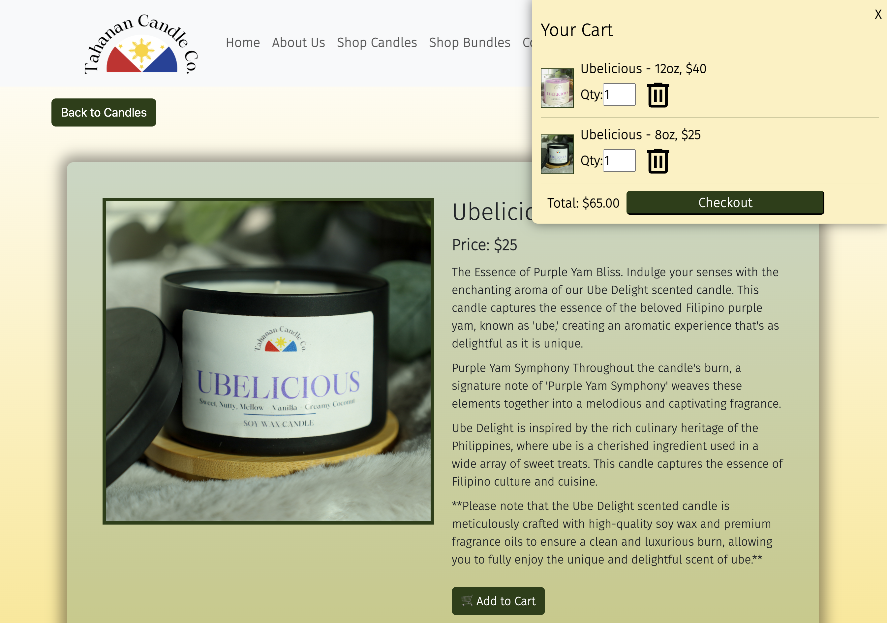

# Tahanan Candle Company

## Description
This website is for a small, Filipina-owned candle company based in SLC, Utah. We created this project to help the client sell their uniquely scented candles inspired from Philippines scents and culture.  

Check out the deployed website here: [Tahanan Candle Co.](https://tahanancandleco.onrender.com/)  
  

## Table of Contents
If your README is long, add a table of contents to make it easy for users to find what they need.

- [Installation](#installation)
- [Usage](#usage)
- [Features](#features)
- [Credits](#credits)

## Installation
What are the steps required to install your project? Provide a step-by-step description of how to get the development environment running. 
1. ```npm install```
2. Create a free EmailJS account (optional)

## Usage
Provide instructions and examples for use. Include screenshots as needed. 
Steps to run project in VS Code  
1. Create a .env  
```
STRIPEKEY=yourStripeKey
```
2. Create a .env file in the client folder containing your EmailJs variables: (optional: for forms & checkout to work)  
```
VITE_SERVICE_ID=yourID
VITE_TEMPLATE_ID=yourTemplateId
VITE_BULK_TEMPLATE_ID=yourTemplateId
VITE_PUBLIC_KEY=yourPublicKey
VITE_STRIPE_KEY=yourStripeKey
```
3. ```npm run seed```  
4. ```npm run develop```

## Features
- Users can create/login to an account
- View items available for purchase
- Add items to cart and checkout using Stripe
- Fill out and send a contact form with EmailJS
  


## Credits
The collaborators for this project were:  
[Matthew Thurber](https://github.com/mjthurber)  
[Whitney Brady](https://github.com/whitbreezy)  
[Maggie McCausland](https://github.com/maggiemcc)  
[Britt Young](https://github.com/britt-young)  
[Joshua Higginson](https://github.com/joshhigg)  
Special thanks to: [Steve Calla](https://github.com/stevecalla) for helping us solve StripeAPI and deployment issues.

Resources/Technologies used:  
[Vite](https://vitejs.dev/)  
[React](https://react.dev/)  
[MongoDB](https://www.mongodb.com/cloud/atlas/lp/try4?utm_source=google&utm_campaign=search_gs_pl_evergreen_atlas_core_retarget-brand_gic-null_amers-us-ca_ps-all_desktop_eng_lead&utm_term=mongodb&utm_medium=cpc_paid_search&utm_ad=e&utm_ad_campaign_id=14291004479&adgroup=128837427347&cq_cmp=14291004479&gad_source=1&gclid=CjwKCAiA2pyuBhBKEiwApLaIO0HgUGyKWTUCayi8S-rPK1kT-YgZnI8Qeyho2lEpH_lRDzd1RhmP5RoCtUgQAvD_BwE)  
[Stripe API](https://stripe.com/?utm_campaign=US_en_Search_Brand_Stripe_EXA-20839462206&utm_medium=cpc&utm_source=google&ad_content=683853401230&utm_term=stripe&utm_matchtype=e&utm_adposition=&utm_device=c&gclid=CjwKCAiAq4KuBhA6EiwArMAw1B2GTnrG-Diq8pq2zqL69774qetU9jgaNNUojmnhZzAUoF8WQdOv-xoC1DgQAvD_BwE)  
[EmailJS](https://www.emailjs.com/)  
[Bootstrap](https://getbootstrap.com/)


## Badges

